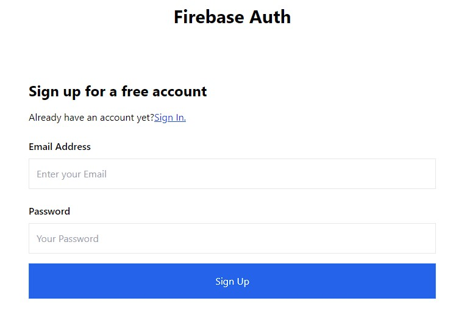

[Demo App](https://react-firebase-app-five.vercel.app/).

# React App - Firebase Auth
### In this App I made Firebase v9 Authentication in React JS. I created a new user by email address, sign in, sign out, and check to see if a user is logged in or not. I used react-router-dom v6 to navigate pages after signing in. I also used protected routes. This means you will be required to be signed-in as a user to view the specified page otherwise the user is routed to the sign in page. All the UI styling is done with tailwind css.

[Demo App](https://react-firebase-app-five.vercel.app/).
